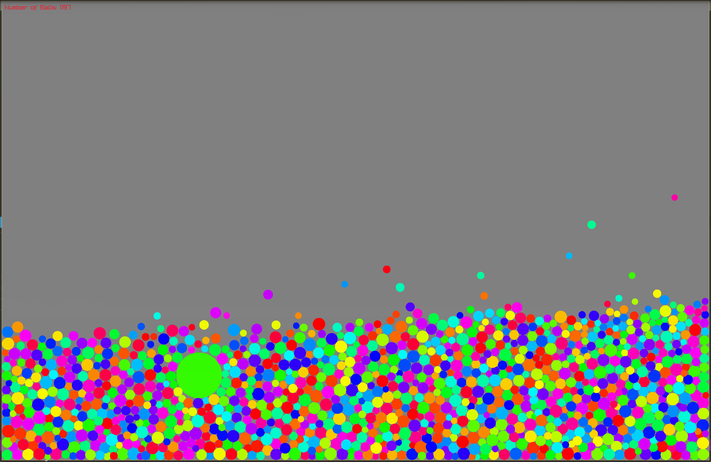

# Odin_Test

Testing Odin and Raylib integration

Balls Physics Test

Left Click to hold a ball and inflate it

Right Click to Create new balls

Move and Resize window effect the balls

It compiles to WASM using this https://github.com/Caedo/raylib_wasm_odin

you can try it at

https://odin.chudlife.online
